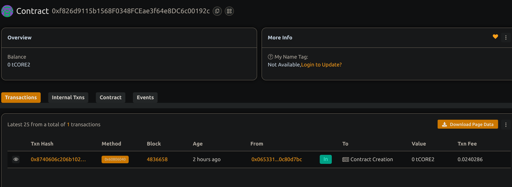

# SimpleLottery

## Project Description
SimpleLottery is a basiccally a decentralized lottery smart contract where participants can enter by paying a fixed entry fee. The contract manager can then  pick a winner randomly who receives the entire balance of the contract.

## Project Vision
To create a transparent and trustless lottery system on the blockchain that ensures fairness and easy participation without intermediaries.

## Key Features
- Fixed entry fee for all of, them and each participants
- Manager-only function to pick a winner
- Random winner selection based on blockchain variables (note: not secure for production)
- Automatic payout of the contract balance to the winner and 
- Lottery history tracking by lottery ID

## Future Scope
- Integrate secure randomness using Chainlink VRF or similar oracle services
- Add multiple lottery rounds with different entry fees and prizes
- Enable participant refunds if minimum players not reached
- Build a frontend interface for easier participation and results viewing

## Contract details
0xf826d9115b1568F0348FCEae3f64e8DC6c00192c

